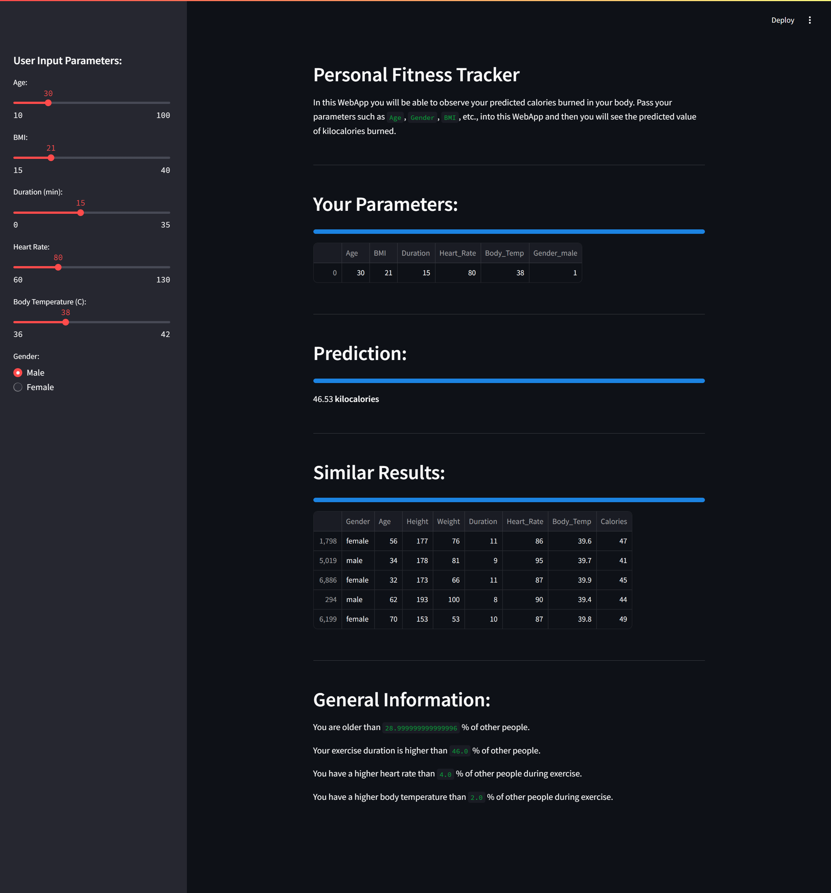
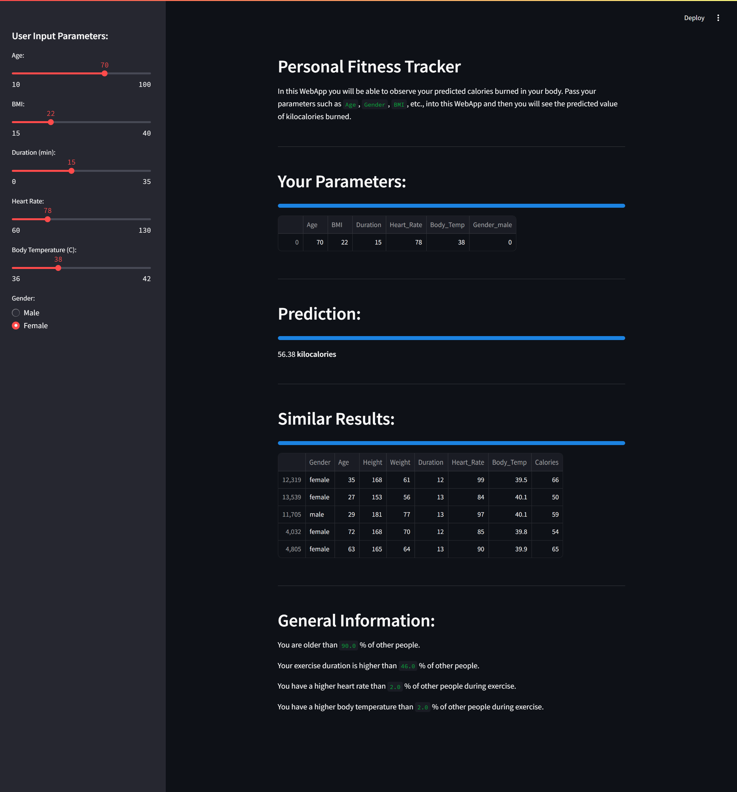

💪 Personal Fitness Tracker 🏃‍♂️🚀
🔗 GitHub Repository: https://github.com/sreeja-9/Personal-Fitness-Tracker

⭐ GitHub Stars: https://github.com/sreeja-9/Personal-Fitness-Tracker/stargazers

🔀 GitHub Forks: https://github.com/sreeja-9/Personal-Fitness-Tracker/network

🐛 GitHub Issues: https://github.com/sreeja-9/Personal-Fitness-Tracker/issues

📜 License: https://github.com/sreeja-9/Personal-Fitness-Tracker/blob/main/LICENSE

🏆 Your AI-powered fitness companion to track, analyze, and improve your health!
🔥 Stay on top of your fitness journey with smart recommendations & insights!

🎯 Why Choose This Fitness Tracker?
✅ AI-Driven Insights – Get real-time health & fitness recommendations.
✅ Smart Tracking – Monitor steps, calories, workouts, and progress.
✅ Dynamic Visuals – Interactive charts & graphs for data-driven decisions.
✅ Personalized Goal Setting – Define and track your fitness milestones.
✅ User-Friendly Dashboard – Simple yet powerful interface.

📊 Track. Analyze. Improve. Achieve!

🚀 Tech Stack Used
🔥 Tech Stack	🏋️ Purpose
🐍 Python	Core Programming Language
🤖 Machine Learning	AI-Powered Recommendations
📊 Pandas & NumPy	Data Processing & Analytics
📈 Matplotlib & Seaborn	Stunning Data Visualizations
🖥️ Tkinter / Streamlit	Intuitive User Interface
🖼️ Screenshots & Live Demo

## 📷 Screenshots  

### 🔹 Example1
  

### 🔹 Example2

📥 Installation Guide
🔹 Step 1: Clone the Repository
bash
Copy
Edit
git clone https://github.com/sreeja-9/Personal-Fitness-Tracker.git
cd Personal-Fitness-Tracker
🔹 Step 2: Install Dependencies
bash
Copy
Edit
pip install -r requirements.txt
🔹 Step 3: Run the Application
bash
Copy
Edit
python app.py
💡 Modify app.py for UI options (Tkinter/Streamlit).

📊 How It Works
📌 1. Input Fitness Data (Weight, Calories, Steps, Workouts, etc.)
📌 2. AI Analyzes & Processes Data 🤖
📌 3. Generates Personalized Reports & Smart Suggestions 📊
📌 4. Track & Improve Your Daily, Weekly & Monthly Progress 📈

🔥 Make data-driven fitness decisions and smash your goals!

🚀 Upcoming Features
✨ AI Chatbot – Your virtual fitness assistant!
📱 Mobile App Integration – Track your progress anywhere.
📊 Advanced Analytics – In-depth insights into your fitness journey.

💡 Your suggestions matter! Open an issue to recommend features!

🤝 Contribute & Support
💡 Want to contribute? Fork the repo, submit a PR & let's build together!

📌 Contributions, feature requests, and feedback are always welcome!

🚀 Help improve this project by giving it a star! ⭐

🎉 Enjoyed this project? Star it & share with your friends! 🚀🔥
